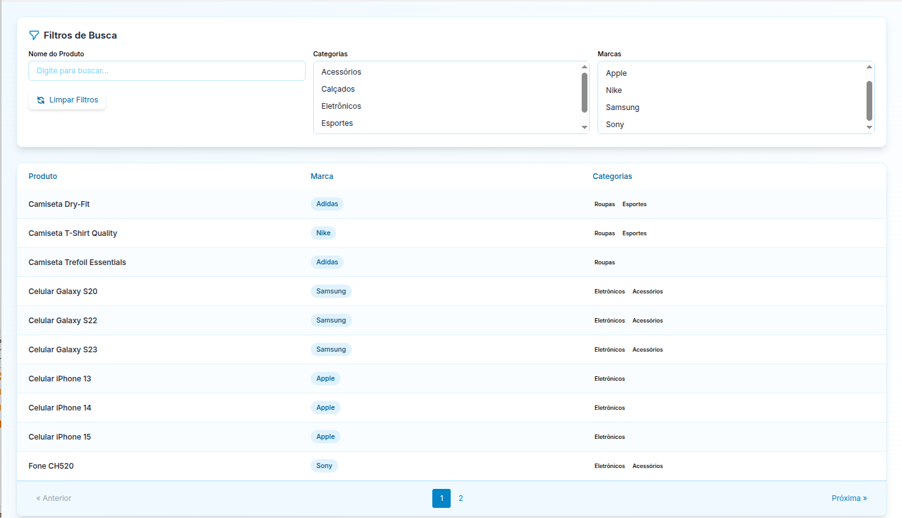

# Desafio Técnico Fullstack PHP/Laravel

## Requisitos para subir o sistema:
- Docker
- Docker compose

### Siga os passos abaixo para subir o sistema de filtro de produtos

### Clone o repositório para uma pasta ex: filtro-produtos
```
git clone git@github.com:andrescherrer/moot_lm-frotas_teste.git filtro-produtos
```

### Faça build da imagem:
```
docker compose up --build -d
```

### Instale a aplicação através do composer install
```
docker exec -it app composer install
```

### Crie o .env da aplicação
```
cp .env.example .env
```

### Altere o .env com os dados abaixo:
```
DB_CONNECTION=pgsql
DB_HOST=database
DB_PORT=5432
DB_DATABASE=lmfrotas
DB_USERNAME=user
DB_PASSWORD=secret
```

### Crie uma key para aplicação:
```
php artisan key:generate  
```

### Execute o migrate abaixo para popular o banco:
```
docker exec -it app php artisan migrate:refresh --seed
```

### Execute o script
```
docker exec -it app npm run dev
```

### Acesse a aplicação:
```
localhost:8000
```

### usuário: admin@teste.com 
### senha: senha123



### Executar testes:
```
php artisan test --filter=ProductSearchTest
```